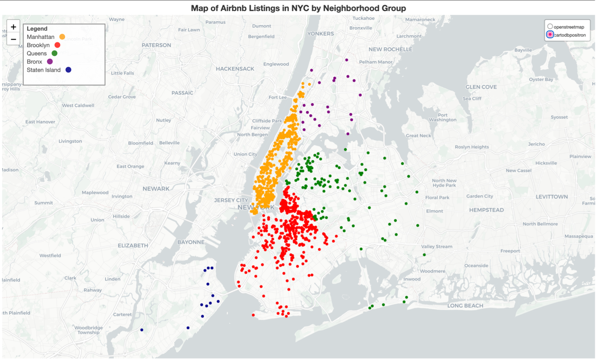
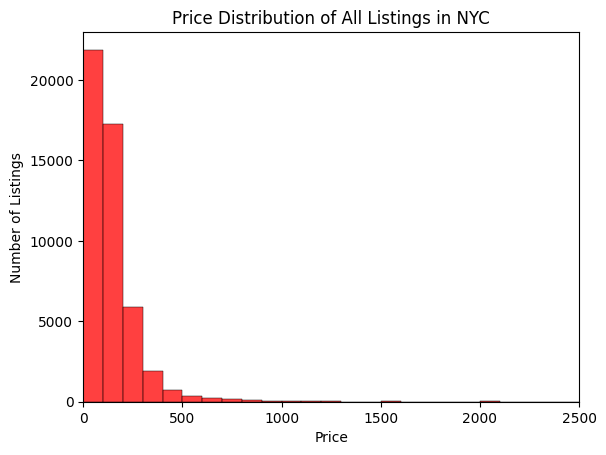
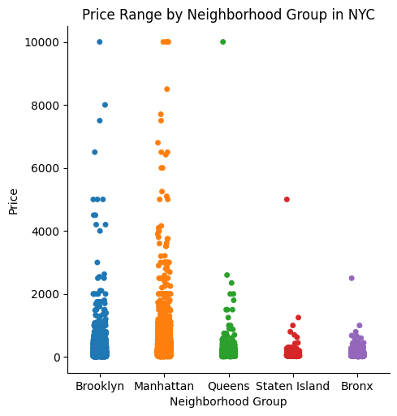
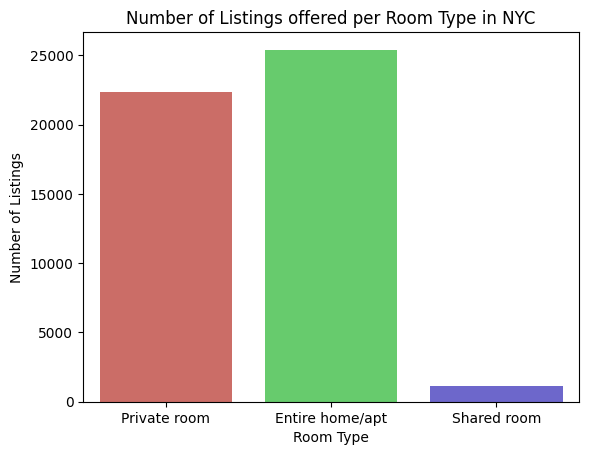
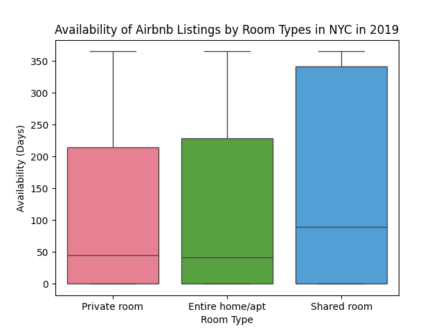

# NYC-Airbnb-Exploratory-Data-Analysis

EDA project examining Airbnb pricing, room types, availability, and geographic patterns in 2019 New York City Airbnb listings using Python.

## Project Overview
This project performs exploratory data analysis (EDA) on the 2019 New York City Airbnb Open Data dataset using Python and Google Colab. The objective was to identify trends in Airbnb pricing, room types, neighborhood activity, and listing availability to generate data-driven insights for current and future Airbnb hosts.

The analysis investigates how factors such as geographic location, neighborhood group, room type, and pricing influence Airbnb listing performance throughout New York City.

## Objectives

The main goals of this project were to:

- Clean and preprocess Airbnb listing data
- Handle missing values, outliers, and remove irrelevant variables
- Perform exploratory data analysis (EDA)
- Explore relationships between pricing, room type, and availability
- Visualize geographical distributions of Airbnb listings
- Analyze price ranges across NYC neighborhoods
- Generate insights that may optimize Airbnb listing strategies

## Dataset

Dataset used: 

**New York City Airbnb Open Data (2019)**

Source:

https://www.kaggle.com/datasets/dgomonov/new-york-city-airbnb-open-data 

License: **CC0 Public Domain**

**New York City Airbnb Open Data (2019)**

Variables analyzed include:

- Price
- Room type
- Neighborhood groups
- Availability (365 days)
- Latitude
- Longitude

## Tools & Libraries Used

- Python
- Google Colab
- Pandas
- NumPy
- Matplotlib
- Seaborn
- Folium

## Analysis Performed

This project included:

✔ Data cleaning and preprocessing  
✔ Missing value handling  
✔ Geographic visualization using Folium  
✔ Price distribution analysis
✔ Neighborhood price comparisons  
✔ Room type and availability analysis  
✔ Exploratory visualizations and trend identification

## Key Findings

Insights identified during analysis include:

- Manhattan and Brooklyn contained the highest Airbnb activity.
- Most Airbnb listings were priced below $200/night.
- Manhattan showed the widest price range and highest-priced listings.
- Entire homes/apartments and private rooms demonstrated greater demand than shared rooms.
- Location and room type appeared to influence pricing and occupancy trends.

## Visualizations
### Geographic Distribution of Airbnb Listings


### Price Distribution Across Listings


### Price Range by Neighborhood Group


### Number of Listings by Room Type


### Room Type Availability Analysis


## Interactive Map

An interactive Folium map was also created for the geographic Airbnb listing analysis.
To interact with the map, download `nyc_airbnb_map.html` and open it locally in a web browser.

[View/download the interactive NYC Airbnb map](nyc_airbnb_map.html)

## Repository Structure

```text
NYC-Airbnb-Exploratory-Data-Analysis/

├── README.md
├── .gitignore
│
├── AB_NYC_2019.csv
├── nyc_airbnb_eda.ipynb
├── airbnb_nyc_eda_report.pdf
├── nyc_airbnb_map.html
│
└── visualizations/
       ├── nyc_map.png
       ├── price_distribution.png
       ├── neighborhood_price_ranges.png
       ├── listings_by_room_type.png
       └── room_type_availability.png
```

## Future Improvements
Potential future work includes:

- Predictive machine learning models for Airbnb pricing
- Occupancy forecasting
- Pricing optimization models
- Expanded geographic analysis

## Author

**Aidee Padilla**

Information Systems • Finance • Supply Chain Management

Python • Data Analytics
